# ICD-10 Diagnosis Code Analytics Engine

A production-grade healthcare data warehouse built with **dbt + Snowflake** that transforms raw Medicare claims data into analytics-ready tables for clinical risk scoring, cost analysis, and revenue leakage detection.

## Architecture

```mermaid
flowchart LR
    A["CMS SynPUF Claims ICD-9 DX"] --> STG
    B["ICD-10-CM Codes"] --> STG
    C["CCS Mappings"] --> STG
    D["HCC Crosswalk"] --> STG
    E["ICD-9 to ICD-10 GEM"] --> STG
    F["HCC Coefficients"] --> STG

    subgraph STG["Staging Layer"]
        stg_claims_inpatient["stg_claims_inpatient"]
        stg_claims_outpatient["stg_claims_outpatient"]
        stg_beneficiaries["stg_beneficiaries"]
        stg_icd10_codes["stg_icd10_codes"]
        stg_ccs_mappings["stg_ccs_mappings"]
        stg_hcc_mappings["stg_hcc_mappings"]
        stg_hcc_coefficients["stg_hcc_coefficients"]
    end

    subgraph INT["Intermediate Layer"]
        int_claims_with_diagnoses["int_claims_with_diagnoses"]
        int_icd9_to_icd10_map["int_icd9_to_icd10_map"]
        int_claims_with_ccs["int_claims_with_ccs"]
        int_claims_with_hcc["int_claims_with_hcc"]
        int_beneficiary_conditions["int_beneficiary_conditions"]
        int_claim_cost_by_diagnosis["int_claim_cost_by_diagnosis"]
        int_mapping_coverage_by_claim_type["int_mapping_coverage_by_claim_type"]
    end

    subgraph MRT["Marts Layer"]
        mart_patient_risk_scores["mart_patient_risk_scores"]
        mart_high_cost_conditions["mart_high_cost_conditions"]
        mart_diagnosis_category_summary["mart_diagnosis_category_summary"]
        mart_risk_tier_cohorts["mart_risk_tier_cohorts"]
        mart_revenue_leakage_flags["mart_revenue_leakage_flags"]
    end

    STG --> INT --> MRT
```



## Tech Stack

| Component | Technology |
|---|---|
| Data Warehouse | Snowflake |
| Transformation | dbt Core + dbt-snowflake |
| Language | SQL, Python, Jinja |
| Testing | dbt tests + dbt-expectations |
| Version Control | Git + GitHub |

## Data Sources

All data is publicly available at no cost:

| Dataset | Source |
|---|---|
| CMS SynPUF Claims (~2M beneficiaries) | [CMS.gov](https://www.cms.gov/data-research/statistics-trends-and-reports/medicare-claims-synthetic-public-use-files) |
| ICD-10-CM Code Set (~72,000 codes) | [CMS.gov](https://www.cms.gov/medicare/coding-billing/icd-10-codes) |
| ICD-9 to ICD-10 GEM | [CDC FTP](https://ftp.cdc.gov/pub/Health_Statistics/NCHS/Publications/ICD10CM/2018/2018_I9gem.txt) |
| CCS Mappings | [AHRQ HCUP](https://hcup-us.ahrq.gov/toolssoftware/ccsr/ccs_refined.jsp) |
| HCC Crosswalk + Coefficients | [CMS.gov](https://www.cms.gov/medicare/health-plans/medicareadvtgspecratestats/risk-adjustors) |

## Project Structure

```
icd10_analytics/
├── models/
│   ├── staging/        # Source cleanup, renaming, type casting
│   ├── intermediate/   # Joins, enrichment, business logic
│   └── marts/          # Analytics-ready output tables
├── seeds/              # Reference CSVs (ICD-10, CCS, HCC)
├── tests/              # Custom singular tests
├── macros/             # Reusable Jinja logic
└── dbt_project.yml
```

## Local Setup

```bash
# Clone the repo
git clone https://github.com/SK2837/ICD-10-Diagnosis-Code-Analytics-Engine.git
cd ICD-10-Diagnosis-Code-Analytics-Engine

# Create and activate virtual environment
python3 -m venv venv
source venv/bin/activate

# Install dependencies
pip install dbt-snowflake

# Configure Snowflake credentials (never commit this file)
cp profiles.yml.example ~/.dbt/profiles.yml
# Edit ~/.dbt/profiles.yml with your Snowflake credentials

# Test connection
dbt debug

# Run all models
dbt run

# Run tests
dbt test

# Generate documentation
dbt docs generate
dbt docs serve
```

## Execution Runbook

Run these commands in order after data is in `ICD10_DB.RAW`:

```bash
# Install dbt packages
dbt deps

# Load seeds (includes ICD-9 -> ICD-10 GEM crosswalk)
dbt seed

# Build and validate by layer
dbt run --select staging
dbt test --select staging

dbt run --select intermediate
dbt test --select intermediate

dbt run --select marts
dbt test --select marts

# Full project validation
dbt test
dbt docs generate
```

## Data Model Layers

### Staging
Views sitting directly on raw source tables. Handles renaming, type casting, and deduplication. No business logic.

### Intermediate
Joins staging tables and applies business logic — including ICD-9 to ICD-10 mapping before CCS/HCC enrichment.

### Marts
Final analytics-ready tables materialized as Snowflake tables:
- **mart_patient_risk_scores** — HCC risk scores and tier assignments per beneficiary
- **mart_high_cost_conditions** — diagnosis codes ranked by total cost, flags above 90th percentile
- **mart_diagnosis_category_summary** — aggregate metrics by CCS clinical category
- **mart_risk_tier_cohorts** — patient cohort definitions by risk tier with demographics
- **mart_revenue_leakage_flags** — under-coded diagnoses that may represent revenue leakage

## Example Analytical Queries

```sql
-- 1) Top beneficiaries by risk score
select beneficiary_id, total_hcc_score, risk_tier, top_hccs
from ICD10_DB.DBT_DEV_MARTS.MART_PATIENT_RISK_SCORES
order by total_hcc_score desc
limit 25;
```

```sql
-- 2) Risk tier distribution
select risk_tier, count(*) as beneficiaries
from ICD10_DB.DBT_DEV_MARTS.MART_PATIENT_RISK_SCORES
group by risk_tier
order by beneficiaries desc;
```

```sql
-- 3) Highest-cost diagnoses
select diagnosis_code, total_allocated_cost, beneficiaries, cost_rank
from ICD10_DB.DBT_DEV_MARTS.MART_HIGH_COST_CONDITIONS
where is_high_cost = true
order by total_allocated_cost desc
limit 50;
```

```sql
-- 4) Spend by diagnosis category
select ccsr_category, total_allocated_cost, beneficiaries, claims
from ICD10_DB.DBT_DEV_MARTS.MART_DIAGNOSIS_CATEGORY_SUMMARY
order by total_allocated_cost desc
limit 25;
```

```sql
-- 5) Revenue leakage candidates
select claim_id, beneficiary_id, leakage_reason, missing_hcc_count, missing_hcc_categories
from ICD10_DB.DBT_DEV_MARTS.MART_REVENUE_LEAKAGE_FLAGS
where is_potential_revenue_leakage = true
limit 50;
```

```sql
-- 6) Mapping coverage by claim type
select *
from ICD10_DB.DBT_DEV_INTERMEDIATE.INT_MAPPING_COVERAGE_BY_CLAIM_TYPE
order by claim_type;
```

```sql
-- 7) Cohort-level average risk by demographic segment
select risk_tier, age_band, sex_code, race_code, beneficiary_count, avg_total_hcc_score
from ICD10_DB.DBT_DEV_MARTS.MART_RISK_TIER_COHORTS
order by avg_total_hcc_score desc
limit 50;
```

```sql
-- 8) Leakage rate by claim type
select
  claim_type,
  count(*) as claim_count,
  count_if(is_potential_revenue_leakage) as leakage_claims,
  round(count_if(is_potential_revenue_leakage) / nullif(count(*), 0), 4) as leakage_rate
from ICD10_DB.DBT_DEV_MARTS.MART_REVENUE_LEAKAGE_FLAGS
group by claim_type
order by leakage_rate desc;
```

## Notes

- SynPUF claims in this pipeline are ICD-9-based; clinical mapping quality depends on ICD-9 -> ICD-10 GEM translation quality.
- Current HCC coefficient model includes placeholder fallback behavior; replace with official year-specific coefficient inputs for production actuarial use.
