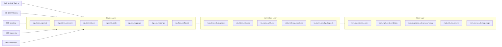

# ICD-10 Diagnosis Code Analytics Engine

A production-grade healthcare data warehouse built with **dbt + Snowflake** that transforms raw Medicare claims data into analytics-ready tables for clinical risk scoring, cost analysis, and revenue leakage detection.

## Architecture



## Tech Stack

| Component | Technology |
|---|---|
| Data Warehouse | Snowflake |
| Transformation | dbt Core + dbt-snowflake |
| Language | SQL, Python, Jinja |
| Testing | dbt tests + dbt-expectations |
| Version Control | Git + GitHub |

## Data Sources

All data is publicly available at no cost:

| Dataset | Source |
|---|---|
| CMS SynPUF Claims (~2M beneficiaries) | [CMS.gov](https://www.cms.gov/data-research/statistics-trends-and-reports/medicare-claims-synthetic-public-use-files) |
| ICD-10-CM Code Set (~72,000 codes) | [CMS.gov](https://www.cms.gov/medicare/coding-billing/icd-10-codes) |
| CCS Mappings | [AHRQ HCUP](https://hcup-us.ahrq.gov/toolssoftware/ccsr/ccs_refined.jsp) |
| HCC Crosswalk + Coefficients | [CMS.gov](https://www.cms.gov/medicare/health-plans/medicareadvtgspecratestats/risk-adjustors) |

## Project Structure

```
icd10_analytics/
├── models/
│   ├── staging/        # Source cleanup, renaming, type casting
│   ├── intermediate/   # Joins, enrichment, business logic
│   └── marts/          # Analytics-ready output tables
├── seeds/              # Reference CSVs (ICD-10, CCS, HCC)
├── tests/              # Custom singular tests
├── macros/             # Reusable Jinja logic
└── dbt_project.yml
```

## Local Setup

```bash
# Clone the repo
git clone https://github.com/SK2837/ICD-10-Diagnosis-Code-Analytics-Engine.git
cd ICD-10-Diagnosis-Code-Analytics-Engine

# Create and activate virtual environment
python3 -m venv venv
source venv/bin/activate

# Install dependencies
pip install dbt-snowflake

# Configure Snowflake credentials (never commit this file)
cp profiles.yml.example ~/.dbt/profiles.yml
# Edit ~/.dbt/profiles.yml with your Snowflake credentials

# Test connection
dbt debug

# Run all models
dbt run

# Run tests
dbt test

# Generate documentation
dbt docs generate
dbt docs serve
```

## Data Model Layers

### Staging
Views sitting directly on raw source tables. Handles renaming, type casting, and deduplication. No business logic.

### Intermediate
Joins staging tables and applies business logic — mapping ICD-10 codes to CCS clinical categories and HCC risk adjustment categories.

### Marts
Final analytics-ready tables materialized as Snowflake tables:
- **mart_patient_risk_scores** — HCC risk scores and tier assignments per beneficiary
- **mart_high_cost_conditions** — diagnosis codes ranked by total cost, flags above 90th percentile
- **mart_diagnosis_category_summary** — aggregate metrics by CCS clinical category
- **mart_risk_tier_cohorts** — patient cohort definitions by risk tier with demographics
- **mart_revenue_leakage_flags** — under-coded diagnoses that may represent revenue leakage
